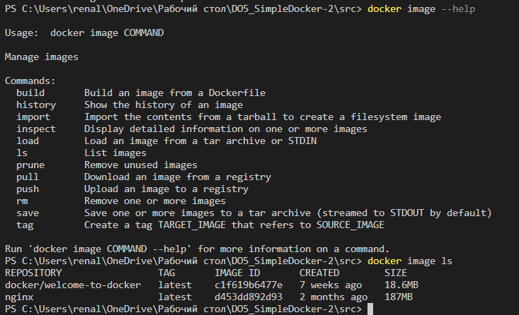
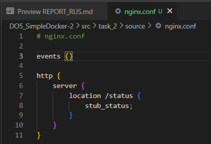
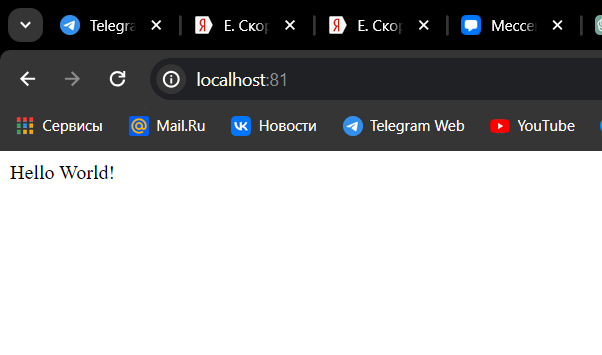
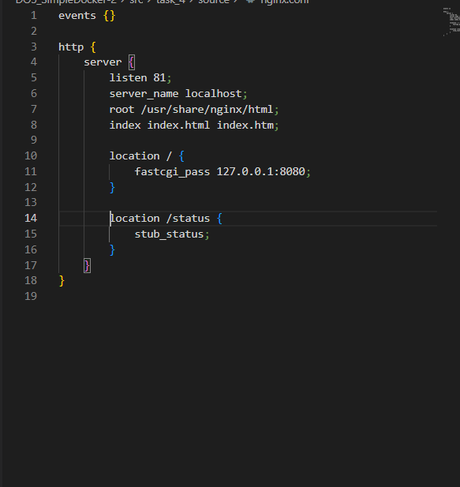
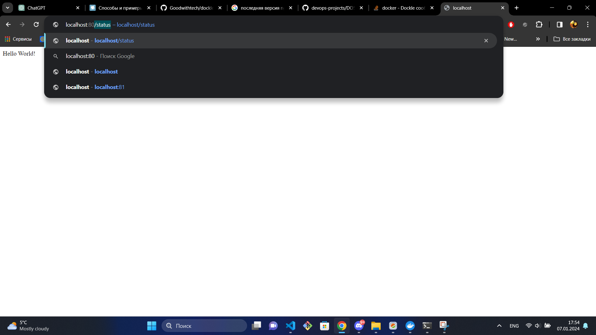

<a href="https://www.docker.com/">
    
</a>

# Работса с docker на windows

* [Скачивание, перезапуск и базовые команды](#скачивание-перезапуск-и-базовые-команды)
* [Настройка nginx.conf](#настройка-nginxconf)
* [Сервен на fastcgi на языке си](#сервен-на-fastcgi-на-языке-си)
* [Написание Dockerfile для выполнения всех позиций выше](#написание-dockerfile-для-выполнения-всех-позиций-вышесервен-на-fastcgi-на-языке-си)
* [Использование Dockle](#использование-dockle)
* [Создания Docker-compose.yml](#создания-docker-composeyml)


В связи с безопасностью - часть скриншотов об выполненной работе были сильно урезаны и удалены


## Скачивание, перезапуск и базовые команды

> скачиваю образ контейнера `docker pull nginx`

> проверяю наличие образа `docker images ls` + размер контейнера


> запускаю образ `docker run -d nginx`

> проверка запуска образа `docker ps`

> часть информации о контейнере `docker inspect [container_id|container_name]`

> остановка образа контейнера `docker stop [container_id|container_name]` и `docker ps -a`

> запуск образа на портах 80 и 443 `docker run -d -p 80:80 -p 443:443 nginx`
> если вписать в браузер http://localhost:80 оторазиться официальная страница nginx

> перезапуск и проверка `docker restart [container_id|container_name]`


## Настройка nginx.conf

> содержимое оригинального файла nginx `docker exec [container_id|container_name] cat /etc/nginx/nginx.conf`

> содержимое нового файла nginx.conf, находиться в папке ./task_2/source


> коопирование моего файла в образ контейнера `docker cp nginx.conf [container_id|container_name]:/etc/nginx/nginx.conf`

> перезапуск через `exec` `docker exec [container_id|container_name] nginx -s reload`

> экспорт контейнера `docker export [container_id|container_name] -o container.tar`

> остановка образа `docker stop [container_id|container_name]` 

> удаление образа `docker rmi -f [image_id]`

> удаление остановленного контейнера  `docker rm -f [container_id|container_name]`

> импорт `docker import ./container.tar`

> добавляем к локальному файлу тэг `docker tag [image_id] my_import_image:nginx`

> запуск образа на портах 80 и 443 `docker run -d -p 80:80 -p 443:443 my_import_image:nginx nginx -g `daemon off;`
> проверяем статус на странице http://localhost:80/status


## Сервен на fastcgi на языке си

> написал простой сервер с ответом `hello world` на си, для дальнейшего запуска его на порту 81
> сервер нахоидться в папке ./task_3/source/main.c

> написал конфигурацию nginx, для прослушивания порта 81 с использоватнием FastCGIЮ для обработки запросов в докере (порт 8080)
> конфигурация находиться в ./task_3/source/nginx.conf

> так как я работаю внутри образа, я  решил скачать все пакеты и сам сервер в образ.
> обновление программы `apt-get`:
* `docker exec [container_id|container_name] apt-get update`
> cкачивание пакетов:
* `docker exec [container_id|container_name] apt-get install -y libfcgi-dev`
* `docker exec [container_id|container_name] apt-get install spawn-fcgi`
> скачивание компилятора:
* `docker exec [container_id|container_name] apt-get install -y install gcc`

> коопирование файлов в докер
* `docker cp main.c [container_id|container_name]:task_3/source/main.c`
* `docker cp nginx.conf [container_id|container_name]:/etc/nginx/nginx.conf`

> перезапуск nginx `docker exec [container_id|container_name] nginx -s reload`

> компиляция файла сервера в испольняемый файл сервена `server` 
* `docker exec [container_id|container_name] gcc -o server main.c -lfcgi`

> запуск сервера `docker exec spawn-fcgi -p 8080 ./server`

> проверка сервера:



## Написание Dockerfile для выполнения всех позиций [выше](#сервен-на-fastcgi-на-языке-си)

Dockerfile (task_4/source/Dockerfile):

``` Dockerfile
FROM nginx

RUN apt-get update && apt-get install -y \
    libfcgi-dev \
    spawn-fcgi \
    gcc

COPY main.c .
COPY nginx.conf /etc/nginx/nginx.conf

RUN gcc -o server main.c -lfcgi
EXPOSE 8080 
CMD spawn-fcgi -p 8080 server && nginx -g 'daemon off;'
```

> сборка образа через команду `build`. Для сборки нужно находитсья в одной директории
> `docker build -t name/part:tag`

> запуск с маппингом порта 81 на порт 80 `docker run -d -p 80:81 [image_id]`
> проверка http://localhost:80

> исправление nginx.conf


> перезапуск контейнера 


## Использование Dockle

Так как я работаю на windows, я использовал образ dockle, поэтому запуск его немного специфичный

> скачивание dockle `docker pull goodwithtech/dockle`

> запустил его согласно официальному репозиторию `docker run --rm -v /var/run/docker.sock:/var/run/docker.sock goodwithtech/dockle [image_id]`

> получил отчеты об ошибках
* FATAL CIS-DI-0010
* FATAL DKL-DI-0005
* WARN CIS-DI-0001
* WARN DKL-DI-0006
* прочие INFO

> Для устранения серьезных ошибок мне пришлось переписать Dockerfile (task_5/source/Dockerfile)
* в нем добавил пользователя
* папки внутри nginx
* разрешения для nginx
* удалил истории apt-get

``` Dockerfile
FROM nginx:latest
RUN apt-get update && apt-get install -y \
    libfcgi-dev \
    spawn-fcgi \
    gcc \
    && rm -rf /var/lib/apt/lists/*
RUN groupadd -r appgroup && useradd -r -g appgroup new_user
USER new_user
COPY main.c /tmp/
COPY nginx.conf /etc/nginx/nginx.conf
RUN gcc -o /tmp/server /tmp/main.c -lfcgi
USER root
RUN mkdir -p /var/cache/nginx/client_temp \
    && chown -R new_user:appgroup /var/cache/nginx/client_temp \
    && chmod -R 777 /var/cache/nginx/client_temp
EXPOSE 8080 
CMD spawn-fcgi -p 8080 /tmp/server && nginx -g 'daemon off;'
```

> для принятия подозрительного (FATAL CIS-DI-0010), тк я не использую данные переменные окружения (это внутри nginx) я использовал флаг `--ak NGINX_GPGKEY_PATH --ak NGINX_GPGKE`

> запуск `docker run --rm -v /var/run/docker.sock:/var/run/docker.sock goodwithtech/dockle --ak NGINX_GPGKEY_PATH --ak NGINX_GPGKEY [image_id|image_name:tag]`


## Создания Docker-compose.yml

> Новые файлы docker-compose.yml, nginx.conf, назодяться в ./task_6/source/

В docker-compose.yml я использую два контейнера, один который создается из dockerfile папки ./task_5/source/, первый контейнер используеть свой nginx.conf из ./task_5/source/.

Мой основной контейнер nginx, запускается на порту 80 и передает все изменения.
Его nginx.conf - прослушивает порт 8080. Порт 80 проксирует все запросы на порт 81.

Для того, чтобы создать веб-сервер использую команды `docker-compose build` и  для запуска `docker-compose run`

